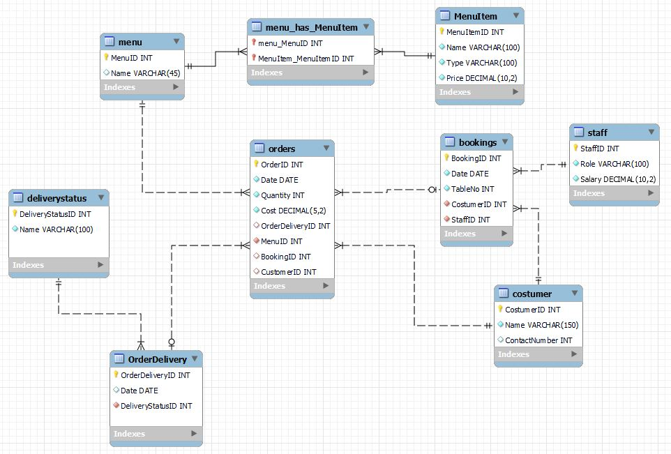
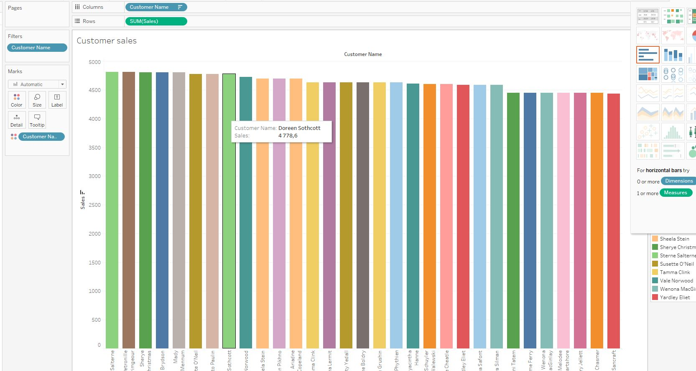
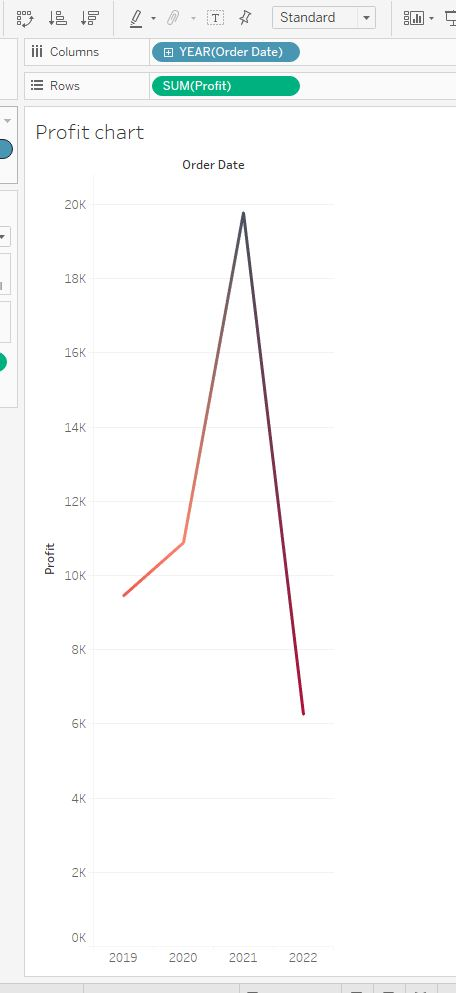
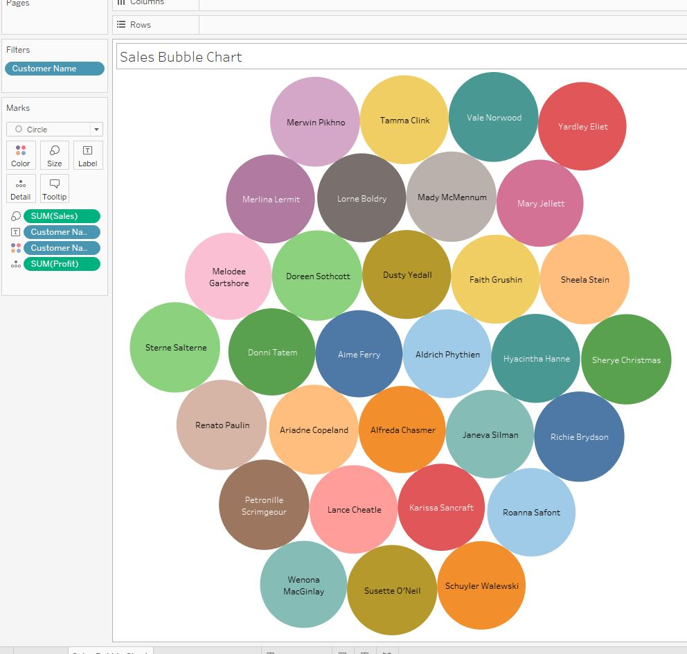
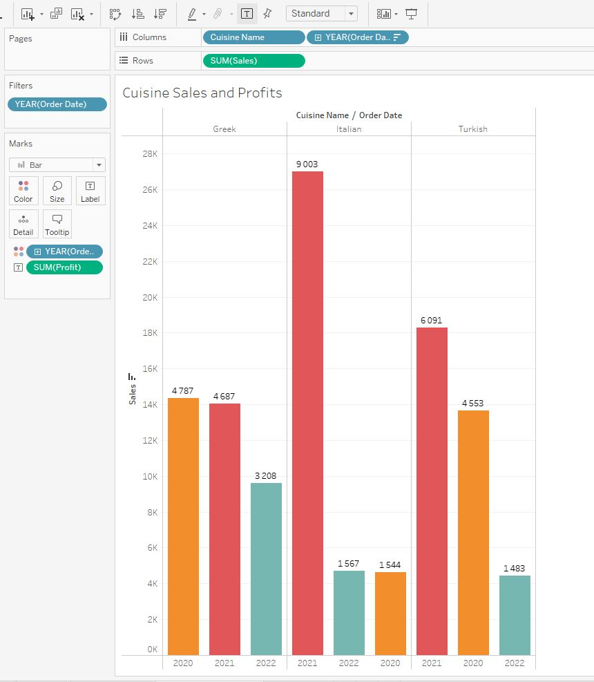

# Meta Capstone Project





# Inserting data

```
INSERT INTO staff (StaffID, Role, Salary) VALUES
(1,"Manager", 7000),
(2, "Assistant ", 4500),
(3, "Head Chef", 6500.30),
(4, "Assistant  ", 3500.20),
(5, "Assistant", 3500.20),
(6, "Assistant", 3500.20);
```

```
INSERT INTO costumer (CostumerID, Name, ContactNumber) VALUES
(1,"Rose Hugh", 4352021),
(2, "Natiel Ferdison", 4334674),
(3, "Clarck Hudson", 4334674),
(4, "Yaburn Trabar", 4334674),
(5, "Rafael Montolla", 4334645),
(6, "Yessica Thouk", 2334674),
(7, 'Anna Iversen', 1235678),
(8, "Joakim Iversen", 2342389),
(9, 'Vanessa McCarthy', 4567834),
(10, 'Marcos Romero', 4128745),
(11, 'Hiroki Yamane', 2672309),
(12, 'Diana Pinto', 51245674);
```

No order assigned yet
```
INSERT INTO bookings (BookingID, Date, TableNo, CostumerID, StaffID) VALUES
(1, "2-11-23", 2, 4, 2),
(2, "2-11-23", 2, 4, 2),
(3, "2-11-23", 4, 3, 5),
(4, "2-11-23", 6, 4, 6);
```

```
INSERT INTO menuitem (MenuItemID, Name, Type, Price) VALUES
(1, 'Olives','Starters',5),
(2, 'Flatbread','Starters', 5.15),
(3, 'Minestrone', 'Starters', 8.85),
(4, 'Tomato bread','Starters', 8),
(5, 'Falafel', 'Starters', 7),
(6, 'Hummus', 'Starters', 5),
(7, 'Greek salad', 'Main Courses', 15.05),
(8, 'Bean soup', 'Main Courses', 12),
(9, 'Pizza', 'Main Courses', 15),
(10, 'Greek yoghurt','Desserts', 7.75),
(11, 'Ice cream', 'Desserts', 6),
(12, 'Cheesecake', 'Desserts', 4),
(13, 'Athens White wine', 'Drinks', 25),
(14, 'Corfu Red Wine', 'Drinks', 30.55),
(15, 'Turkish Coffee', 'Drinks', 10),
(16, 'Turkish Coffee', 'Drinks', 10.00),
(17, 'Kabasa', 'Main Courses', 17.05);
```

```
INSERT INTO orderdeliverystatus
(OrderDeliveryStatusID, StatusName)
VALUES
(1, "In Progress"),
(2, "Not placed"),
(3, "Not delivered"),
(4, "Delivered");
```


```
insert into orderdelivery (OrderDeliveryID, Date, OrderDeliveryStatusID)
VALUES (3, "2-11-23", 1);
```

```
insert into menu (MenuID, MenuItemID)
VALUES
(1,1),
(2,1),
(3,3);
```

```
INSERT INTO orders (
OrderID,
Date,
Quantity,
Cost,
OrderDeliveryID,
MenuID,
BookingID,
CustomerID
) VALUES
(3, "2-11-23", 3, 95.45, 3, 3, 1, 4),
(2, "2-11-23", 2, 40.05, 1, 2, 1, 2),
(1, "2-11-23", 3, 115.55, 1, 3, 1, 6),
(4, "2-11-23", 4, 95.45, 4, 4, 2, 5)
```

```
insert into orderdelivery
(OrderDeliveryID,Date,DeliveryStatusID)
values
(1, "2-11-23", 1),
(2, "2-11-23", 1),
(4, "2-11-23", 1)
```

# Part 1


## Task 1
In the first task, Little Lemon need you to create a virtual table called OrdersView that focuses on OrderID, Quantity and Cost columns within the Orders table for all orders with a quantity greater than 2.

Here’s some guidance around completing this task:

1. Use a CREATE VIEW statement.
2. Extract the order id, quantity and cost data from the Orders table.
3. Filter data from the orders table based on orders with a quantity greater than 2.

You can query the OrdersView table using the following syntax:


```
CREATE VIEW OrdersView AS select OrderID, Quantity, Cost from orders
```

```
Select * from OrdersView;
```


## Task 2
For your second task, Little Lemon need information from four tables on all customers with orders that cost more than $150. Extract the required information from each of the following tables by using the relevant JOIN clause:

1. Customers table: The customer id and full name.
2. Orders table: The order id and cost.
3. Menus table: The menus name.
4. MenusItems table: course name and starter name.
5. The result set should be sorted by the lowest cost amount.


```
select c.CostumerID, c.Name, o.OrderID, o.Cost, m.Name as MenuName, i.Name as Course
from costumer c
inner join orders o
on c.CostumerID = o.CustomerID
inner join menu m
on o.MenuID = m.MenuID
inner join menu_has_menuitem h
on m.MenuID = h.menu_MenuID
inner join menuitem i
on i.MenuItemID = h.MenuItem_MenuItemID
where i.Type = "Main Courses"
```


## Task 3
For the third and final task, Little Lemon need you to find all menu items for which more than 2 orders have been placed. You can carry out this task by creating a subquery that lists the menu names from the menus table for any order quantity with more than 2.

Here’s some guidance around completing this task:

1. Use the ANY operator in a subquery
2. The outer query should be used to select the menu name from the menus table.
3. The inner query should check if any item quantity in the order table is more than 2.

Part 1 (my way)
```
select m.Name from orders o
inner join menu m
on m.MenuID = o.MenuID
where o.Quantity > 2
```
```
select * from orders where
Quantity > 2;
```


Solution
```
select Name from menu where
MenuID = ANY (select MenuID from orders where
Quantity > 2)
```


# Part 2

## Task 1
In this first task, Little Lemon need you to create a procedure that displays the maximum ordered quantity in the Orders table.

Creating this procedure will allow Little Lemon to reuse the logic implemented in the procedure easily without retyping the same code over again and again to check the maximum quantity.

```
create procedure getMaxQuantity(OUT maxQuantity INT)
select max(Quantity) INTO maxQuantity from orders;
```

```
call getMaxQuantity(@maxQty)
```

```
select @maxQty
```

## Task 2
In the second task, Little Lemon need you to help them to create a prepared statement called GetOrderDetail. This prepared statement will help to reduce the parsing time of queries. It will also help to secure the database from SQL injections.

The prepared statement should accept one input argument, the CustomerID value, from a variable.

The statement should return the order id, the quantity and the order cost from the Orders table. 

Once you create the prepared statement, you can create a variable called id and assign it value of 1.


```
PREPARE GetOrderDetail FROM "SELECT OrderID, Quantity, Cost FROM orders WHERE CustomerID = ?"
```

```
SET @id = 1;
EXECUTE GetOrderDetail USING @id;
```

## Task 3
Your third and final task is to create a stored procedure called CancelOrder. Little Lemon want to use this stored procedure to delete an order record based on the user input of the order id.

Creating this procedure will allow Little Lemon to cancel any order by specifying the order id value in the procedure parameter without typing the entire SQL delete statement.


```
CREATE PROCEDURE CancelOrder (IN OrderNo INT)
DELETE FROM orders WHERE OrderID = OrderNo
```

```
call CancelOrder(3)
```


# Part 3

## Task 1
Little Lemon wants to populate the Bookings table of their database with some records of data. Your first task is to replicate the list of records in the following table by adding them to the Little Lemon booking table.

You can use simple INSERT statements to complete this task

```
insert into bookings (
BookingID,
Date,
TableNo,
CostumerID,
StaffID)
values
(5, "2022-10-10", 5, 1, 6),
(6, "2022-10-10", 3, 3, 2),
(7, "2022-10-10", 2, 2, 5),
(8, "2022-10-10", 2, 1, 4)
```

```
select * from bookings
```

## Task 2

For your second task, Little Lemon need you to create a stored procedure called CheckBooking to check whether a table in the restaurant is already booked. Creating this procedure helps to minimize the effort involved in repeatedly coding the same SQL statements.

The procedure should have two input parameters in the form of booking date and table number. You can also create a variable in the procedure to check the status of each table.


```
DELIMITER //
CREATE PROCEDURE CheckBooking(IN bookDate DATE, IN tableNum INT)
BEGIN
  IF EXISTS (select * from bookings where TableNo = tableNum AND Date = bookDate) THEN
    SELECT CONCAT('Table ', tableNum, ' already booked.') AS message;
  ELSE
    SELECT CONCAT('Table available ') AS message;
  END IF;
END //
DELIMITER ;
```

```
call CheckBooking("2022-10-10", 8)
```

## Task 3
For your third and final task, Little Lemon need to verify a booking, and decline any reservations for tables that are already booked under another name.

Since integrity is not optional, Little Lemon need to ensure that every booking attempt includes these verification and decline steps. However, implementing these steps requires a stored procedure and a transaction.

To implement these steps, you need to create a new procedure called AddValidBooking. This procedure must use a transaction statement to perform a rollback if a customer reserves a table that’s already booked under another name.

Use the following guidelines to complete this task:

The procedure should include two input parameters in the form of booking date and table number.

It also requires at least one variable and should begin with a START TRANSACTION statement.

Your INSERT statement must add a new booking record using the input parameter's values.

Use an IF ELSE statement to check if a table is already booked on the given date.

If the table is already booked, then rollback the transaction. If the table is available, then commit the transaction.

The screenshot below is an example of a rollback (cancelled booking), which was enacted because table number 5 is already booked on the specified date.


```
DELIMITER //
CREATE PROCEDURE AddValidBooking(IN bookDate DATE, IN tableNum INT)
BEGIN
  DECLARE result INT DEFAULT 0;
  IF EXISTS (select * from bookings where TableNo = tableNum AND Date = bookDate) THEN
    SELECT CONCAT('Table ', tableNum, ' already booked.') AS message;
  ELSE
	START TRANSACTION;
	  SELECT CONCAT('Table available ') AS message;
	  INSERT INTO bookings (BookingID, Date, TableNo, CostumerID, StaffID) VALUES (9, bookDate, tableNum, 7, 5);
	  IF ROW_COUNT() > 0 THEN
		-- success
		SET result = 1;
		COMMIT;
	  ELSE
		-- failure
		SET result = 0;
		ROLLBACK;
	  END IF;
  END IF;
END //
DELIMITER ;
```

```
call AddValidBooking("2022-10-10", 8)
```

# Part 4

## Task 1

In this first task you need to create a new procedure called AddBooking to add a new table booking record.

The procedure should include four input parameters in the form of the following bookings parameters:
booking id,
customer id,
booking date,
and table number.

```
DELIMITER //
CREATE PROCEDURE AddBooking(
IN bookingID INT, IN customerID INT, IN bookDate DATE, IN tableNum INT, IN staffID INT)
BEGIN
  DECLARE result INT DEFAULT 0;
  IF EXISTS (select * from bookings where TableNo = tableNum AND Date = bookDate AND BookingID = bookingID) THEN
    SELECT CONCAT('Table ', tableNum, ' already booked or order duplicated') AS message;
  ELSE
	START TRANSACTION;
	  SELECT CONCAT('Table available ') AS message;
	  INSERT INTO bookings (BookingID, Date, TableNo, CostumerID, StaffID) VALUES (bookingID, bookDate, tableNum, customerID, staffID);
	  IF ROW_COUNT() > 0 THEN
		-- success
		SET result = 1;
		COMMIT;
	  ELSE
		-- failure
		SET result = 0;
		ROLLBACK;
	  END IF;
  END IF;
END //
DELIMITER ;
```

```
call AddBooking(10, 5, "2023-10-11", 3, 5)
```

## Task 2
For your second task, Little Lemon need you to create a new procedure called UpdateBooking that they can use to update existing bookings in the booking table.

The procedure should have two input parameters in the form of booking id and booking date. You must also include an UPDATE statement inside the procedure.

The screenshot below shows an example of the UpdateBooking procedure in use.


```
DELIMITER //
CREATE PROCEDURE UpdateBooking(IN ID INT, IN bookDate DATE)
BEGIN
  DECLARE result INT DEFAULT 0;
  IF EXISTS (select * from bookings where BookingID = bookingID) THEN
	UPDATE bookings SET Date = bookDate WHERE BookingID = ID;
    SELECT CONCAT('Booking number ', ID, ' rescheduled to ', bookDate) AS message;
  ELSE
	START TRANSACTION;
	  SELECT CONCAT('Booking doesn\'t exists or is the same date') AS message;
	  IF ROW_COUNT() > 0 THEN
		-- success
		SET result = 1;
		COMMIT;
	  ELSE
		-- failure
		SET result = 0;
		ROLLBACK;
	  END IF;
  END IF;
END //
DELIMITER ;
```

```
call UpdateBooking(10, "2023-10-11")
```

## Task 3
For the third and final task, Little Lemon need you to create a new procedure called CancelBooking that they can use to cancel or remove a booking.

The procedure should have one input parameter in the form of booking id. You must also write a DELETE statement inside the procedure.

```
DELIMITER //
CREATE PROCEDURE CancelBooking(IN ID INT)
BEGIN

  DECLARE result INT DEFAULT 0;
  START TRANSACTION;
  IF EXISTS (select * from bookings where BookingID = ID) THEN
    DELETE FROM bookings WHERE BookingID = ID;
  ELSE
	  IF ROW_COUNT() > 0 THEN
		-- success
        SELECT CONCAT('Booking  ', ID, ' cancelled.') AS message;
		SET result = 1;
		COMMIT;
	  ELSE
		-- failure
        SELECT CONCAT('Booking doesn\'t exists pr another error ocurred') AS message;
		SET result = 0;
		ROLLBACK;
	  END IF;
  END IF;
END //
DELIMITER ;
```

```
call CancelBooking(9)
```

# Part 5

## Task 1
In this first task, you need to connect to Little Lemon data stored in the Excel Sheet called LittleLemonDB. Then filter data in the data source page and select the United States as the country.

Here’s some guidance for completing this task:

Open Tableau. In the Connection Pane select Excel, then navigate to the data source.

In the data source page, select Filter Tab.


## Task 2
In the second task, you need to create two new data fields called First Name and Last Name. Related values should be extracted from the Full Name field.

Here’s some guidance for completing this task:

You can use the Split feature in Tableau.

Rename the new fields.


## Task 3
For your third task, you need to create a new data field that stores the profits for each sale, or order as shown in the screenshot below.

Here’s some guidance for completing this task:

Select Sales field in the Data Pane, then select Create Calculated field.

Name the calculated field Profit.

Write a formula that deducts Cost from Sales.

Once you complete these tasks you should be ready to perform data analytics and to create visual charts.

# Part 6

## Task 1
In the first task, you need to create a bar chart that shows customers sales and filter data based on sales with at least $70.

Here’s some guidance for completing this task:

Drag and drop relevant fields from the data pane into the shelves section.

Use a suitable colour scheme.

Filter sales based on sales >= $70.

Name the chart Customers sales.

Answer image:

<hr>

## Task 2
In the second task, you need to create a line chart to show the sales trend from 2019 to 2022.

Here’s some guidance for completing this task:

Drag and drop relevant fields from the data pane.

Use a suitable colour scheme.

Filter data to exclude 2023.

Name the chart Profit chart.

Answer image:



<hr>

## Task 3
In the third task, you need to create a Bubble chart of sales for all customers. The chart should show the names of all customers. Once you roll over a bubble, the chart should show the name, profit and sale.

Here’s some guidance for completing this task:

Drag and drop relevant fields from the data pane.

Use a suitable colour scheme.

Name the chart Sales Bubble Chart.

Your chart should show the following Bubble chart.

Answer image:


<br>


## Task 4
In this task, you need to compare the sales of the three different cuisines sold at Little Lemon. Create a Bar chart that shows the sales of the Turkish, Italian and Greek cuisines.

You need to display sales data for 2020, 2021, and 2022 only. Each bar should display the profit of each cuisine.

Here’s some guidance for completing this task:

Drag and drop relevant fields from the data pane.

Use a suitable color scheme.

Name the worksheet Cuisine Sales and Profits.

Sort data in descending order by the sum of the sale.

Your chart should be similar to the following example:

Answer image:


<br>

## Task 5
In this final task, you need to create an interactive dashboard that combines the Bar chart called Customers sales and the Sales Bubble Chart. Once you click a bar, and roll over the related bubble, the name, sales and profit figures should be displayed in the Bubble chart as shown below.


Here is the result for task 5: https://public.tableau.com/app/profile/cesar.orozco4337/viz/MetaCapstone_16860689601270/Dashboard1?publish=yes


