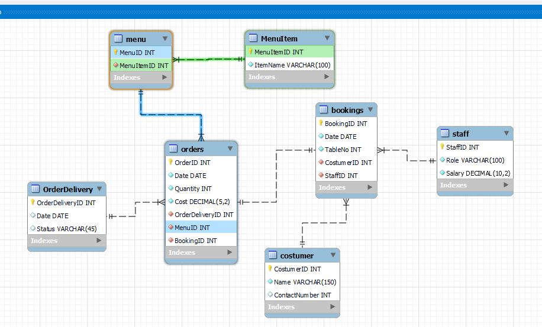

# Meta Capstone Project





# Inserting data

```
INSERT INTO staff (StaffID, Role, Salary) VALUES
(1,"Manager", 7000),
(2, "Assistant ", 4500),
(3, "Head Chef", 6500.30),
(4, "Assistant  ", 3500.20),
(5, "Assistant", 3500.20),
(6, "Assistant", 3500.20);
```

```
INSERT INTO costumer (CostumerID, Name, ContactNumber) VALUES
(1,"Rose Hugh", 4352021),
(2, "Natiel Ferdison", 4334674),
(3, "Clarck Hudson", 4334674),
(4, "Yaburn Trabar", 4334674),
(5, "Rafael Montolla", 4334645),
(6, "Yessica Thouk", 2334674);
```

No order assigned yet
```
INSERT INTO bookings (BookingID, Date, TableNo, CostumerID, StaffID) VALUES
(1, "2-11-23", 2, 4, 2);
```

```
INSERT INTO bookings (BookingID, Date, TableNo, CostumerID, StaffID) VALUES
(2, "2-11-23", 2, 4, 2)
```

OrderID int PK
Date date
Quantity int
Cost decimal(5,2)
OrderDeliveryID int
CostumerID int
MenuID int


```

```


```
INSERT INTO orders (OrderID,
Date,
Quantity,
Cost,
OrderDeliveryID,
CostumerID,
MenuID) VALUES
(1, "2-11-23", 5, 5500.45, 1, 1, 2)
```

```

```

